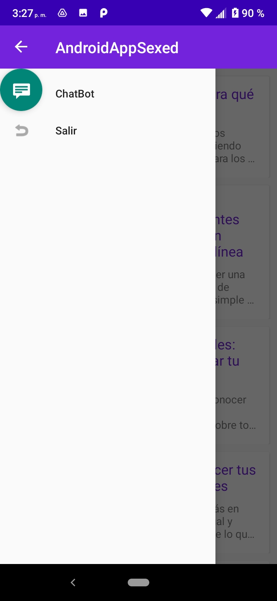
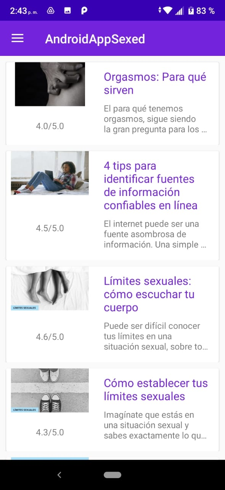

<!-- PROJECT SHIELDS -->

[![Contributors][contributors-shield]][contributors-url]
[![Forks][forks-shield]][forks-url]
[![Stargazers][stars-shield]][stars-url]
[![Issues][issues-shield]][issues-url]
[![MIT License][license-shield]][license-url]
[![LinkedIn][linkedin-shield]][linkedin-url]

# sexED 
_sexED (sexual education) es una aplicación móvil diseñada para brindar educación sexual de manera accesible y confiable. Nuestro objetivo es proporcionar información precisa y relevante sobre salud sexual y relaciones saludables._

## Características de la aplicación  📋
* Acceso a contenido educativo sobre temas de educación sexual.
* Interacción con un chatbot para respuestas a preguntas comunes.

## Objetivos de la aplicación  📋
* Facilitar el acceso a información actualizada y confiable sobre educación sexual.
* Fomentar una actitud positiva y respetuosa hacia la sexualidad.
* Proporcionar herramientas interactivas y recursos educativos.
* Promover la prevención de embarazos no deseados.
* Implementar un chatbot.

## App  📋

## Diagrama UML

El diagrama se encuentra en [Diagrama UML](https://lucid.app/lucidchart/569169ad-7b3c-4d8d-8b99-35b9f098086a/edit?viewport_loc=-882%2C-1071%2C2560%2C1216%2C0_0&invitationId=inv_1e306450-4c15-499c-98d7-090fdc287abb).

## Documentación 📋

Encontrarás documentación detallada sobre la especificación de requisitos en [Requisitos](docs/is3_doc_req.pdf).

Adicionalmente aquí se encuentra el espacio de trabajo creado en Trello [Tablero](https://trello.com/b/EqBpKCVb/educaci%C3%B2n-sexual)

## Construido con 🛠️
* [DialogFlow](https://cloud.google.com/)
* [Rest Api Word Press](https://wordpress.com)
* [Java](https://www.java.com/)

## Instalación 🛠️

1. Clona este repositorio en tu máquina local.
2. Instala las dependencias necesarias.
3. Ejecuta la aplicación en tu dispositivo o emulador.

## Contribución 🖇️

_¡Estamos abiertos a recibir contribuciones! Si tienes alguna idea, mejora o corrección, no dudes en hacer una solicitud de extracción._

## Equipo ✒️
- [Bejar Merma Angel Andres](https://github.com/ubuangel)
- [Yanqui Vera Henry Aron](https://github.com/hyanquiv)
- Bustamante Torres Luis Angel
- Vilca Alvites Cecilia del Pilar

<!-- MARKDOWN LINKS & IMAGES -->
<!-- https://www.markdownguide.org/basic-syntax/#reference-style-links -->
[contributors-shield]: https://img.shields.io/github/contributors/ubuangel/Sexed.svg?style=for-the-badge
[contributors-url]: https://github.com/ubuangel/Sexed/graphs/contributors
[forks-shield]: https://img.shields.io/github/forks/ubuangel/Sexed.svg?style=for-the-badge
[forks-url]: https://github.com/ubuangel/Sexed/network/members
[stars-shield]: https://img.shields.io/github/stars/ubuangel/Sexed.svg?style=for-the-badge
[stars-url]: https://github.com/ubuangel/Sexed/stargazers
[issues-shield]: https://img.shields.io/github/issues/ubuangel/Sexed.svg?style=for-the-badge
[issues-url]: https://github.com/ubuangel/Sexed/issues
[license-shield]: https://img.shields.io/github/license/ubuangel/Sexed.svg?style=for-the-badge
[license-url]: https://github.com/ubuangel/Sexed/blob/main/LICENSE.txt
[linkedin-shield]: https://img.shields.io/badge/-LinkedIn-black.svg?style=for-the-badge&logo=linkedin&colorB=555
[linkedin-url]: https://linkedin.com/in/angel-andres-bejar-merma-5baaba281
[product-screenshot]: images/resultado1.png
[Unity]: https://img.shields.io/badge/UNITY

<!--[imagen1]: images/pantallaso.png-->
[Unity-url]: https://unity.com/es
[React.js]: https://img.shields.io/badge/React-20232A?style=for-the-badge&logo=react&logoColor=61DAFB
[React-url]: https://reactjs.org/
[Vue.js]: https://img.shields.io/badge/Vue.js-35495E?style=for-the-badge&logo=vuedotjs&logoColor=4FC08D
[Vue-url]: https://vuejs.org/
[Angular.io]: https://img.shields.io/badge/Angular-DD0031?style=for-the-badge&logo=angular&logoColor=white
[Angular-url]: https://angular.io/
[Svelte.dev]: https://img.shields.io/badge/Svelte-4A4A55?style=for-the-badge&logo=svelte&logoColor=FF3E00
[Svelte-url]: https://svelte.dev/
[Laravel.com]: https://img.shields.io/badge/Laravel-FF2D20?style=for-the-badge&logo=laravel&logoColor=white
[Laravel-url]: https://laravel.com
[Bootstrap.com]: https://img.shields.io/badge/Bootstrap-563D7C?style=for-the-badge&logo=bootstrap&logoColor=white
[Bootstrap-url]: https://getbootstrap.com
[JQuery.com]: https://img.shields.io/badge/jQuery-0769AD?style=for-the-badge&logo=jquery&logoColor=white
[JQuery-url]: https://jquery.com 
