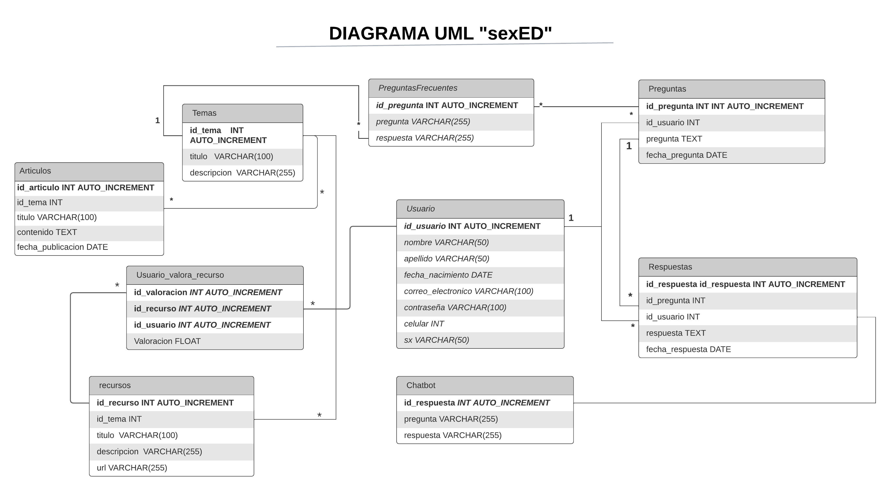

# sexED 
_sexED (sexual education) es una aplicación móvil diseñada para brindar educación sexual de manera accesible y confiable. Nuestro objetivo es proporcionar información precisa y relevante sobre salud sexual y relaciones saludables._

## Características de la aplicación  📋
* Acceso a contenido educativo sobre temas de educación sexual.
* Interacción con un chatbot para respuestas a preguntas comunes.

## Objetivos de la aplicación  📋
* Facilitar el acceso a información actualizada y confiable sobre educación sexual.
* Fomentar una actitud positiva y respetuosa hacia la sexualidad.
* Proporcionar herramientas interactivas y recursos educativos.
* Promover la prevención de embarazos no deseados.
* Implementar un chatbot.

## App  📋

## Diagrama UML

El diagrama se encuentra en [Diagrama UML](https://lucid.app/lucidchart/569169ad-7b3c-4d8d-8b99-35b9f098086a/edit?viewport_loc=-882%2C-1071%2C2560%2C1216%2C0_0&invitationId=inv_1e306450-4c15-499c-98d7-090fdc287abb).

## Documentación 📋

Encontrarás documentación detallada sobre la especificación de requisitos en [Requisitos](docs/is3_doc_req.pdf).

Adicionalmente aquí se encuentra el espacio de trabajo creado en Trello [Tablero](https://trello.com/b/EqBpKCVb/educaci%C3%B2n-sexual)

## Construido con 🛠️
* [DialogFlow](https://cloud.google.com/)
* [Rest Api Word Press](https://wordpress.com)
* [Java](https://www.java.com/)

## Instalación 🛠️

1. Clona este repositorio en tu máquina local.
2. Instala las dependencias necesarias.
3. Ejecuta la aplicación en tu dispositivo o emulador.

## Contribución 🖇️

_¡Estamos abiertos a recibir contribuciones! Si tienes alguna idea, mejora o corrección, no dudes en hacer una solicitud de extracción._

## Equipo ✒️
- [Bejar Merma Angel Andres](https://github.com/ubuangel)
- [Yanqui Vera Henry Aron](https://github.com/hyanquiv)
- Bustamante Torres Luis Angel
- Vilca Alvites Cecilia del Pilar

